# Pengenalan Animasi dan Animate CC

## 1.1 Animasi

Animasi merupakan gambar bergerak berbentuk dari sekumpulan objek yang disusun secara beraturan mengikuti pergerakan yang telah ditentukan pada setiap pertambahan hitungan waktu yang terjadi. Gambar atau objek yang dimaksud dalam definisi diatas bisa berupa gambar manusia, hewan, maupun tulisan. Pada proses pembuatannya sang pembuat animasi atau yang lebih dikenal dengan animator harus menggunakan logika berfikir untuk menentukan alur gerak suatu objek dari keadaan awal hingga keadaan akhir objek tersebut. Animasi juga memiliki daya tarik sehingga tampilan dapat terlihat lebih menarik.

### A. Serjarah Animasi

Pada abad 18 saat itu, film animasi yang dibuat banyak menggunakan teknik Stop Motion. Teknik ini menggunakan serangkaian gambar diam/frame yang dirangkai menjadi satu dan menimbulkan kesan seolah-olah gambar tersebut bergerak. Teknik ini sangat sulit, membutuhkan waktu, juga biaya yang banyak. Karena untuk menciptakan animasi selama satu dektik, kita membutuhkan sebanyak 12-24 frame gambar diam. Tokoh yang menjadi pionir perkembangan stop motion adalah J. Stuart Blackton

<!-- Gambar -->

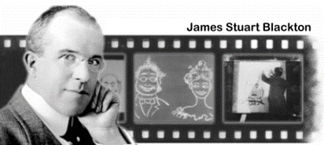

Pada tahun 1928 – 1957 (Film Animation: The Golden Age of Cartoon)
Ini adalah era emas animasi kartun, baik pencapaian secara komersial, teknikal, maupun artistik. Era ini sering diidentikkan dengan era Disney karena di era ini Disney mendominasi animasi dunia yang diawali dengan kesuksesan Steamboat Willie yang melambungkan karakter utamanya Mickey Mouse

Era tahun 1958-1985 (The Television Age) mulai menggeser dominasi layar lebar di bioskop sebagai medium baru untuk menikmati film animasi mulai diproduksi secara serial dan kontinyu. Selain serial animasi juga merambah iklan komersial di televisi. Maka muncullah limited animation dalam proses produksi animasi untuk kebutuhan program televisi yang padat. Di era ini, animasi jepang yang terkenal dengan anime mulai mendominasi dunia melalui serial animasi buatan mereka.

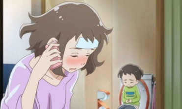

Penemuan teknologi digital tahun 1986- 2010 turut mempengaruhi perkembangan animasi dalam banyak aspek. Kemampuan teknologi digital yang mampu menghadirkan visual yang photo realistik menjadi kekuatan animasi era ini. Munculnya Animasi Toy Story dianggap sebagai tonggak baru film animasi tiga dimensi di era digital. Maka hingga saat ini, bentuk, media, industri, teknologi, cerita, dsb dalam film animasi telah mengalami perubahan yang sangat luar biasa jika dibandingkan dengan awal film animasi pertama ditemukan.

### B. Jenis Jenis Animasi

#### 1. Animasi Tradisional

Jenis ini merupakan tipe awal munculnya animasi yang pertama kali digunakan di dunia hiburan sejak tahun 1930-an. Animator menggambar setiap frame untuk menghasilkan sebuah sequence. Tipe ini disebut cel animation karena pada awalnya, animasi digambar pada celluloid. Pada pembuatan animasi tradisional, setiap tahap gerakan digambar satu persatu di atas cel.

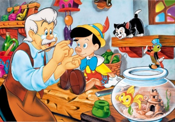

#### 2. Animasi 2D

Pada animasi 2D, figur animasi tersebut dibuat dan diedit di komputer dengan menggunakan 2D bitmap graphics atau 2D vector graphics dengan mengadopsi teknik tradisional, Keberadaan komputer membuat animasi tidak lagi harus digambar pada celluloid atau kertas.

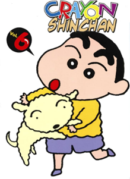

#### 3. Animasi 3D

Animasi 3D adalah animasi perpaduan animasi stopmotion dan animasi 2D dimana animasi ini lebih menggunakan teknik komputer dalam pembuatannya. Teknik animasi terkini yang menggunakan teknologi komputer sebagai media utama dalam pembuatan. Film ini dibuat secara kartun tetapi memiliki kedalaman, sehingga orang dapat melihat bahwa ini seperti orang asli.

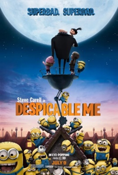

#### 4. Animasi Stop Motion

Stop motion adalah animasi yang menggunakan shooting frame demi frame, menggunakan boneka atau semacamnya. Dimana animasi ini tidak digambar melainkan difoto satu persatu setiap pergerakan benda mati tersebut. Sehingga benda mati/boneka yang sebagai obyek tersebut seolah oleh hidup. Animasi ini sebenarnya sangat diminati oleh animator karena tidak usah menggambar untuk membuat animasi tetapi membutuhkan dana yang cukup besar untuk pembuatannya.

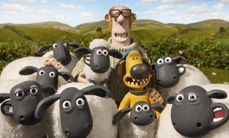

### C. Prinsip Dasar Animasi

#### 1. Solid Drawing

Kemampuan untuk membuat karakter tiga dimensi dalam ruang dua dimensi dan memberikan bobot, kedalaman, dan keseimbangan. Prinsip menggambar yang solid lebih mendasar bagi seorang animator tradisional. Untuk membuat animasinya meyakinkan, seorang animator tradisional harus mampu menggambar karakter dari sudut manapun.

#### 2. Timing & Spacing

Timing adalah tahapan menentukan waktu kapan sebuah gerakan mulai dilakukan. Sementara itu, prinsip spacing merupakan pengaturan kepadatan gambar yang akan memengaruhi timing gerakan benda. Sebagai contoh, ketika suasana sedih, maka gerakan karakter atau kamera menjadi lebih lambat.

#### 3. Squash & Stretch

Squash dan stretch atau prinsip elastisitas adalah penambahan efek plastis pada objek. Pada benda mati, prinsip itu akan memberikan kesan hidup sehingga tampak seperti objek hidup. Sebagai contoh, sebuah bola bulat sempurna yang dilempar dari atas ke bawah. Ketika bola menyentuh tanah, bentuk benda tersebut menjadi lonjong horizontal. Setelah memantul kembali, bola akan berubah menjadi lonjong diagonal.

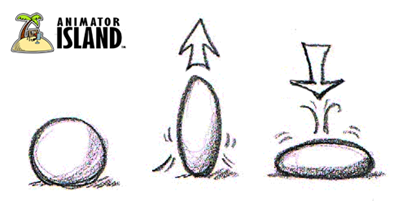

#### 4. Anticipation

Prinsip anticipation menekankan bahwa ada gerakan ancang-ancang (antipasion) sebelum dilakukan sebuah gerakan. Sebagai contoh, ketika seseorang hendak melompat, mereka akan terlebih dahulu menekuk lutut, membungkukkan badan, dan menarik tangan. Baru setelah itu seseorang menghasilkan lompatan

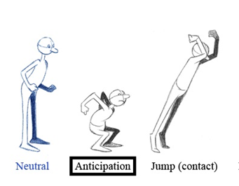

#### 5. Slow In & Slow Out

Slow in dan slow out menunjukan objek membutuhkan peningkatan serta penurunan yang berbeda-beda saat bergerak. Slow in terjadi ketika gerakan awal lambat kemudian menjadi cepat. Kemudian sebaliknya slow out dari gerakan cepat ke lambat.

#### 6. Secondary Action

Secondary action menekankan adanya gerakan-gerakan tambahan untuk memperkuat gerakan utama. Prinsip ini membuat gerakan objek terkesan realistis seperti di kehidupan nyata. Sebagai contoh, gerakan pada saat berjalan, kaki melangkah ke depan, namun tangan akan berayun mengimbangi langkah.

#### 7. Appeal

Prinsip animasi appeal memiliki dua tujuan, yakni sebagai gaya visual keseluruhan isi film dan pembeda karakteristik penokohan. Setiap film memiliki gaya khas yang berbeda dengan film lainnya. Setiap tokoh memiliki daya tarik berbeda dengan karakter lainnya menyesuaikan sifat pembawaan.

#### 8. Arcs

Sistem pergerakan karakter yang ada biasanya bergerak mengikuti pola atau dikenal dengan Arcs. Hal ini dibuat agar karakter bergerak secara smooth dan realistik karena pergerakannya mengikuti sebuah jalur yang sudah dibuat, misalnya lingkaran, elips, atau parabola.

#### 9. Follow Through & Overlapping Action

Follow through bisa digunakan untuk membuat bagian tubuh tertentu tetap bergerak meskipun sebuah karakter berhenti bergerak. Misalnya seletah melompat, rambut si karakter tetap bergerak. Overlapping action secara bisa dianggap sebagai gerakan saling-silang. Maksudnya, adalah serangkaian gerakan yang saling mendahului (overlapping). Contoh : Kelinci yang melompat. Sesaat setelah melompat telinganya masih bergerak-gerak meskipun gerakan utama melompat telah dilakukan.

#### 10. Staging

Prinsip animasi staging meliputi bagaimana lingkungan dibuat untuk mendukung suasana atau ‘mood’ yang ingin dicapai dalam sebagian atau keseluruhan scene. Biasanya berkaitan dengan posisi kamera pengambilan gambar. Posisi kamera bawah membuat karakter terlihat besar dan menakutkan, kamera atas membuat karakter tampak kecil dan bingung sedangkan posisi kamera samping membuat karakter tampak lebih dinamis dan menarik.

#### 11. Straight Ahead & Pose to pose

Ada dua cara yang bisa dilakukan animator dalam membuat animasi, yaitu straight ahead action dan pose to pose. Untuk straight ahead action, seorang animator membuat animasi dengan cara menggambar satu per satu dan dilakukan dengan seorang diri hingga selesai. Kualitasnya memang akan konsisten, tetapi waktu pengerjaan membutuhkan waktu yang lama. Sedangkan pose to pose adalah pembuatan animasi yang dikerjakan hanya dengan menggambar keyframe- keyframe tertentu saja. Pengerjaannya bisa dilakukan oleh banyak orang, sehingga waktu pengerjaannya akan lebih cepat dan cocok untuk industri animasi.

#### 12. Exaggeration

Prinsip animasi exaggeration adalah menekankan tentang gerakan animasi memiliki unsur dramatis dan cenderung hiperbolis. Gerakan animasi yang dramatis ini,biasanya disajikan dalam genre animasi komedi karena beberapa gerakan dramatis tersebut juga cenderung terlalu ekstrem dalam ekspresi tertentu.

### D. Software Animasi

#### 1. Software Animasi 2D

Software animasi 2D adalah software yang digunakan untuk membuat animasi tradisional (flat animation), umumnya mempunyai kemampuan untuk menggambar, mengatur gerak, mengatur waktu, beberapa dapat mengimpor suara. Dari sisi penggunaan umumnya tidak sulit. Contoh dari Software Animasi 2D yaitu:
a. Adobe Animate
b. ToonBoom Studio
c. Corel RaVe
d. Swish Max
e. Adobe After Effect

#### 2. Software Animasi 3D

Software animasi 3D mempunyai fasilitas dan kemampuan yang canggih untuk membuat animasi 3 dimensi. Fasilitas dan kemampuan tersebut antara lain, membuat obyek 3D, pengaturan gerak kamera, pemberian efek, import video dan suara, serta masih banyak lagi.
Contoh dari Software Animasi 3D ini yaitu:
a. Blender
b. Daz3D
c. 3D Studio Max
d. Vue
e. Maya

## 1.2 Pengenalan Adobe Animate CC 2019

Adobe Animate sebelumnya dikenal sebagai Adobe Flash Professional dan Macromedia Flash adalah program yang memungkinkan kita membuat animasi dan grafik vector. Aplikasi ini pertama kali diluncurkan pada tahun 1996 dengan nama FutureSplash Animator. Setelah diakuisisi oleh Macromedia, namanya berubah menjadi Macromedia Flash. Kemudian, pada tahun 2016, setelah Adobe mengakuisisi Macromedia, namanya berubah lagi menjadi Adobe Animate.

### A. Lembar Kerja Adobe Animate

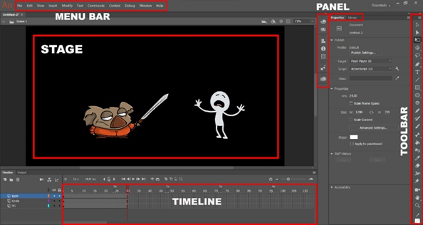

#### 1. Menu Bar

Kumpulan menu berupa perintah yang antara lain File, Edit, View, Insert, Modify, Text, Commands, Control, Debug, Window, dan Help.

#### 2. Timeline

Panel untuk mengatur objek pada tingkat layer maupun frame, serta sebagai pengatur jalannya animasi dan durasi waktu kecepatan frame- nya.

#### 3. Tool Box

Panel berisi kumpulan tool yang dapat digunakan untuk membuat dan edit objek.

#### 4. Stage

Halaman kerja yang digunakan untuk menempatkan objek yang ingin ditampilkan pada saat publishing.

#### 5. Panel

Terdapat 2 letak panel, yaitu pada sisi kanan dan sisi bawah. Panel pada sisi kanan terdapat kumpulan panel yang terdiri dari Color mixer panel, info, transform, component, dan motion presets panel.

### B. Lembar Kerja Adobe Animate

#### 1. Frame, Keyframe, dan Blank Keyframe

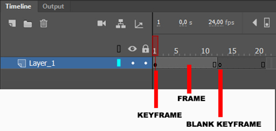

##### a. Frame

Frame adalah tempat objek berada. Isi frame selalu sama dengan keyframe sebelumnya. Untuk menambahkan frame, klik kanan dan pilih "Insert Frame" atau tekan F5.

##### b. Keyframe

Keyframe adalah frame di mana kita dapat meletakkan objek. Ini digunakan untuk mengubah gambar atau objek dark animasi. Untuk menambahkan keyframe, klik kanan dan pilih "Memasukan Keyframe" atau tekan F6.

##### c. Blank Keyframe

Bulatan putih menunjukkan frame yang kosong. Dan jika blank keyframe ini berisi objek, frame ini akan berubah menjadi keyframe. Kita bisa menambahkan blank keyframe dengan klik kanan dan pilih Insert Blank Keyframe atau tekan F7.

#### 2. Layer

Layer Flash dianalogikan sebagai media gambar yang transparan. Dengan menumpuk beberapa gambar yang dibuat pada media transparan, kita dapat membuat komposisi gambar. Gambar di lapisan atas akan menutupi gambar di lapisan bawah, tetapi gambar di lapisan bawah dapat dilihat di area yang kosong di lapisan atas.

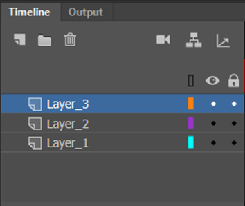

Kegunaan layer:

1. Membuat lebih dari satu Animasi
2. Untuk mengkoordinir elemen-elemen dalam suatu movie
3. Agar tidak terjadi pengirisan objek antara yang satu dengan objek yang lain.
4. Agar dapat lebih cepat menemukan objek, dan lain-lain.

#### 3. Simbol dan Library

Simbol adalah sebuah objek yang dirubah menjadi objek yang dapat digunakan berulang kali, Simbol dapat berupa Movie Clip, Button atau Graphic. Movie Clip merupakan rangkaian gambar di dalamnya (seperti film). Secara default, objek tersebut akan dimainkan berulang-ulang, Button berfungsi sebagai tombol yang dapat di klik, Graphic merupakan simbol yang berupa gambar. Untuk membuat simbol, pilih pada menu Insert > New Symbol untuk membuat simbol baru. Kemudian tentukan behavior dari simbol.

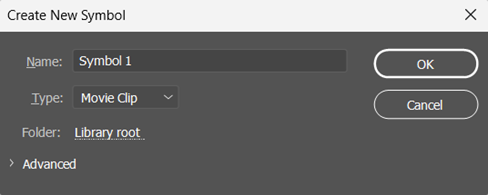

Gambar yang sudah jadi juga dapat diubah menjadi simbol. Pilih gambar di stage kemudian dari menu bar pilih Insert > Convert to Symbol atau tekan F8. Library merupakan tempat penyimpanan dari simbol-simbol yang telah kita buat, simbol-simbol tersebut dapat kita gunakan sewaktu-waktu dengan mengambilnya dari dalam Library.

## 1.3 Praktik Animasi Dasar

Animasi dasar yang nantinya akan sering digunakan pada Adobe Ainamate CC 2019, diantaranya adalah Motion Tween, Shape Tween dan classic tween

### A. Classic Tween

Classic Tween adalah pergerakan suatu objek dari keadaan awal sampai keadaan akhir. sebagai contoh jika ingin menggerakan suatu objek dari kiri ke kanan, dengan adanya Classic tween kita bisa menggunakan sedikit objek tanpa harus membuat banyak objek. Langkah-langkah:

#### 1. Buka Adobe Animate CC 2019 pilih preset Standart untuk percobaan dan platform type menggunakan Action Script 3.0. Dengan Ukuran Width 1280 dan Height 720 Lalu pilih Create

#### 2. Maka tampilannya akan seperti ini

#### 3. Ubah Layer_1 menjadi ‘Classic Tween’.

#### 4. Buat objek lingkaran menggunakan Oval Tool (O), dengan membuat garis tepinya saja tanpa menggunakan fill color letakkan objek seperti gambar dibawah ini.

#### 5. Klik pada garis lingkaran ubah Stroke atau garis, Nilainya 25,00

#### 6. Selanjutnya Buat garis tengah untuk roda menggunakan Line Tool (N), dengan Nilai Stroke 15,00

#### 7. Copy Paste pada garis yang telah dibuat

#### 8. Ubah garis yang telah dibuat menjadi arah Horizontal menggunakan Free Transform Tool, Selanjutnya letakan diposisi Tengah

#### 9. Klik 2x pada garis

#### 10. Selanjutnya Copy Paste dan buatlah bentuknya seperti gambar berikut

#### 11. Selanjutnya Blok gambar Roda kemudian Klik kanan objek Roda tersebut, lalu pilih convert to symbol.

#### 12. Maka akan muncul jendela convert to symbol, lalu ubah Type menjadi Movie Clip dan beri nama Roda

#### 13. Selanjutnya Klik 2x pada gambar roda yang telah di Convert to symbol

#### 14. Klik kanan Pada Layer_1 Frame 2, pilih insert KeyFrame

#### 15. Pada frame 2 Putar Sedikit roda kekanan menggunakan Free Transform Tool

#### 16. Pada frame 3 Caranya sama dengan menggunakan Insert Keyframe terlebih dahulu selanjutnya Putar Sedikit roda kekanan menggunakan Free Transform Tool.

#### 17. Lakukan Hal yang sama sampai pada Frame 8

#### 18. Selanjutnya Pilih Scane untuk kembali

#### 19. Klik kanan pada Frame 20 Layer Classic_Tween, Pilih Insert Keyframe

#### 20. Selanjutnya Geser Ke arah kanan pada Objek Roda

#### 21. Klik kanan antara Frame 1 sampai 20 pilih Create Classic Tween

#### 22. Selanjutnya pada frame 30 Klik Kanan pilih Insert Frame

#### 23. Jalankan animasi dengan ctrl+enter.

### B. Shape Tween

Shape Tween adalah perubahan bentuk dari suatu objek ke objek lain. untuk Shape Tween objek yang dianimasikan harus berjenis Shape, untuk ukuran file yang dihasilkan Shape Tween lebih besar dibandingkan motion Tween

#### 1. Buat layer baru dengan cara klik New Layer, ganti nama layer menjadi ‘Shape Tween’.

#### 2. Buat sebuah objek Persegi pada Layer Shape_Tween frame 1

#### 3. Selanjutnya pada Frame 20 pilih Insert Blank Keyframe

#### 4. Pada frame 20 buat objek Oval Tool

#### 5. Klik Kanan antara frame 1 sampai 20 Kemudian pilih Create Shape Tween

#### 6. Pada Frame 30 Klik kanan pilih Insert Frame

#### 7. Tekan ctrl+enter untuk tes animasi tersebut.

### C. Motion Tween

Motion tween lebih sederhana lagi daripada classic tween karena pada Motion tween, objek yang digunakan harus sama (Objek itu sendiri).

#### 1. Ubah Layer_1 menjadi ‘Motion Tween’.

#### 2. Masukan Gambar Mobil kedalam Frame 1 Layer Motion_Tween

#### 3. Klik kanan objek Mobil tersebut, lalu pilih convert to symbol.

#### 4. Maka akan muncul jendela convert to symbol, lalu ubah Type menjadi Graphic, lalu pilih OK.

#### 5. Klik frame 20 (tepatnya di detik ke 1) di layer Motion_Tween, lalu klik kanan dan pilih Insert Frame.

#### 6. Klik kanan di tengah-tengah antara frame1 sampai 20, pilih Create Motion Tween.

#### 7. Klik frame 20, kemudian pindahkan objek tersebut ke kiri,makan akan muncul sebuah garis yang menunjukkan motion tween. Dengan menyalakan Onion Skin

#### 8. Jalankan animasi dengan ctrl+enter.

