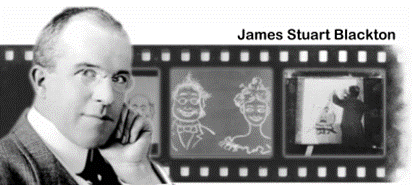
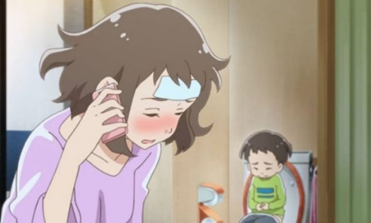
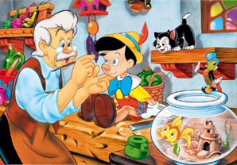
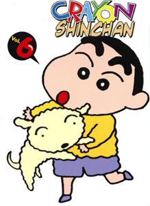
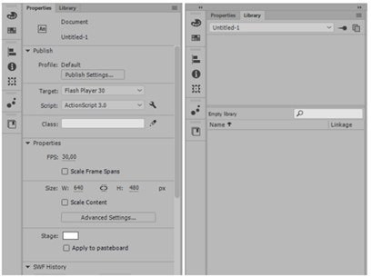
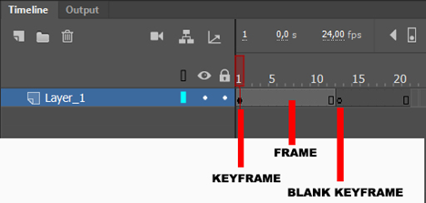
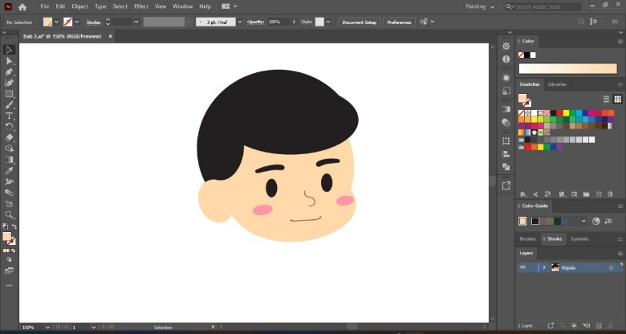

# Pengenalan Animasi dan Pembuatan Karakter

## 1.1 Animasi

Animasi merupakan gambar bergerak berbentuk dari sekumpulan objek yang disusun secara beraturan mengikuti pergerakan yang telah ditentukan pada setiap pertambahan hitungan waktu yang terjadi. Gambar atau objek yang dimaksud dalam definisi diatas bisa berupa gambar manusia, hewan, maupun tulisan. Pada proses pembuatannya sang pembuat animasi atau yang lebih dikenal dengan animator harus menggunakan logika berfikir untuk menentukan alur gerak suatu objek dari keadaan awal hingga keadaan akhir objek tersebut. Animasi juga memiliki daya tarik sehingga tampilan dapat terlihat lebih menarik.

### A. Serjarah Animasi

Pada abad 18 saat itu, film animasi yang dibuat banyak menggunakan teknik Stop Motion. Teknik ini menggunakan serangkaian gambar diam/frame yang dirangkai menjadi satu dan menimbulkan kesan seolah-olah gambar tersebut bergerak. Teknik ini sangat sulit, membutuhkan waktu, juga biaya yang banyak. Karena untuk menciptakan animasi selama satu dektik, kita membutuhkan sebanyak 12-24 frame gambar diam. Tokoh yang menjadi pionir perkembangan stop motion adalah J. Stuart Blackton

Pada tahun 1928 – 1957 (Film Animation: The Golden Age of Cartoon)
Ini adalah era emas animasi kartun, baik pencapaian secara komersial, teknikal, maupun artistik. Era ini sering diidentikkan dengan era Disney karena di era ini Disney mendominasi animasi dunia yang diawali dengan kesuksesan Steamboat Willie yang melambungkan karakter utamanya Mickey Mouse

Era tahun 1958-1985 (The Television Age) mulai menggeser dominasi layar lebar di bioskop sebagai medium baru untuk menikmati film animasi mulai diproduksi secara serial dan kontinyu. Selain serial animasi juga merambah iklan komersial di televisi. Maka muncullah limited animation dalam proses produksi animasi untuk kebutuhan program televisi yang padat. Di era ini, animasi jepang yang terkenal dengan anime mulai mendominasi dunia melalui serial animasi buatan mereka.

Penemuan teknologi digital tahun 1986- 2010 turut mempengaruhi perkembangan animasi dalam banyak aspek. Kemampuan teknologi digital yang mampu menghadirkan visual yang photo realistik menjadi kekuatan animasi era ini. Munculnya Animasi Toy Story dianggap sebagai tonggak baru film animasi tiga dimensi di era digital. Maka hingga saat ini, bentuk, media, industri, teknologi, cerita, dsb dalam film animasi telah mengalami perubahan yang sangat luar biasa jika dibandingkan dengan awal film animasi pertama ditemukan.

### B. Jenis Jenis Animasi

#### 1. Animasi Tradisional

Jenis ini merupakan tipe awal munculnya animasi yang pertama kali digunakan di dunia hiburan sejak tahun 1930-an. Animator menggambar setiap frame untuk menghasilkan sebuah sequence. Tipe ini disebut cel animation karena pada awalnya, animasi digambar pada celluloid. Pada pembuatan animasi tradisional, setiap tahap gerakan digambar satu persatu di atas cel.

#### 2. Animasi 2D

Pada animasi 2D, figur animasi tersebut dibuat dan diedit di komputer dengan menggunakan 2D bitmap graphics atau 2D vector graphics dengan mengadopsi teknik tradisional, Keberadaan komputer membuat animasi tidak lagi harus digambar pada celluloid atau kertas.

#### 3. Animasi 3D

Animasi 3D adalah animasi perpaduan animasi stopmotion dan animasi 2D dimana animasi ini lebih menggunakan teknik komputer dalam pembuatannya. Teknik animasi terkini yang menggunakan teknologi komputer sebagai media utama dalam pembuatan. Film ini dibuat secara kartun tetapi memiliki kedalaman, sehingga orang dapat melihat bahwa ini seperti orang asli.

#### 4. Animasi Stop Motion

Stop motion adalah animasi yang menggunakan shooting frame demi frame, menggunakan boneka atau semacamnya. Dimana animasi ini tidak digambar melainkan difoto satu persatu setiap pergerakan benda mati tersebut. Sehingga benda mati/boneka yang sebagai obyek tersebut seolah oleh hidup. Animasi ini sebenarnya sangat diminati oleh animator karena tidak usah menggambar untuk membuat animasi tetapi membutuhkan dana yang cukup besar untuk pembuatannya.

### C. Prinsip Dasar Animasi

#### 1. Solid Drawing

Kemampuan untuk membuat karakter tiga dimensi dalam ruang dua dimensi dan memberikan bobot, kedalaman, dan keseimbangan. Prinsip menggambar yang solid lebih mendasar bagi seorang animator tradisional. Untuk membuat animasinya meyakinkan, seorang animator tradisional harus mampu menggambar karakter dari sudut manapun.

#### 2. Timing & Spacing

Timing adalah tahapan menentukan waktu kapan sebuah gerakan mulai dilakukan. Sementara itu, prinsip spacing merupakan pengaturan kepadatan gambar yang akan memengaruhi timing gerakan benda. Sebagai contoh, ketika suasana sedih, maka gerakan karakter atau kamera menjadi lebih lambat.

#### 3. Squash & Stretch

Squash dan stretch atau prinsip elastisitas adalah penambahan efek plastis pada objek. Pada benda mati, prinsip itu akan memberikan kesan hidup sehingga tampak seperti objek hidup. Sebagai contoh, sebuah bola bulat sempurna yang dilempar dari atas ke bawah. Ketika bola menyentuh tanah, bentuk benda tersebut menjadi lonjong horizontal. Setelah memantul kembali, bola akan berubah menjadi lonjong diagonal.

#### 4. Anticipation

Prinsip anticipation menekankan bahwa ada gerakan ancang-ancang (antipasion) sebelum dilakukan sebuah gerakan. Sebagai contoh, ketika seseorang hendak melompat, mereka akan terlebih dahulu menekuk lutut, membungkukkan badan, dan menarik tangan. Baru setelah itu seseorang menghasilkan lompatan

#### 5. Slow In & Slow Out

Slow in dan slow out menunjukan objek membutuhkan peningkatan serta penurunan yang berbeda-beda saat bergerak. Slow in terjadi ketika gerakan awal lambat kemudian menjadi cepat. Kemudian sebaliknya slow out dari gerakan cepat ke lambat.

#### 6. Secondary Action

Secondary action menekankan adanya gerakan-gerakan tambahan untuk memperkuat gerakan utama. Prinsip ini membuat gerakan objek terkesan realistis seperti di kehidupan nyata. Sebagai contoh, gerakan pada saat berjalan, kaki melangkah ke depan, namun tangan akan berayun mengimbangi langkah.

#### 7. Appeal

Prinsip animasi appeal memiliki dua tujuan, yakni sebagai gaya visual keseluruhan isi film dan pembeda karakteristik penokohan. Setiap film memiliki gaya khas yang berbeda dengan film lainnya. Setiap tokoh memiliki daya tarik berbeda dengan karakter lainnya menyesuaikan sifat pembawaan.

#### 8. Arcs

Sistem pergerakan karakter yang ada biasanya bergerak mengikuti pola atau dikenal dengan Arcs. Hal ini dibuat agar karakter bergerak secara smooth dan realistik karena pergerakannya mengikuti sebuah jalur yang sudah dibuat, misalnya lingkaran, elips, atau parabola.

#### 9. Follow Through & Overlapping Action

Follow through bisa digunakan untuk membuat bagian tubuh tertentu tetap bergerak meskipun sebuah karakter berhenti bergerak. Misalnya seletah melompat, rambut si karakter tetap bergerak. Overlapping action secara bisa dianggap sebagai gerakan saling-silang. Maksudnya, adalah serangkaian gerakan yang saling mendahului (overlapping). Contoh : Kelinci yang melompat. Sesaat setelah melompat telinganya masih bergerak-gerak meskipun gerakan utama melompat telah dilakukan.

#### 10. Staging

Prinsip animasi staging meliputi bagaimana lingkungan dibuat untuk mendukung suasana atau ‘mood’ yang ingin dicapai dalam sebagian atau keseluruhan scene. Biasanya berkaitan dengan posisi kamera pengambilan gambar. Posisi kamera bawah membuat karakter terlihat besar dan menakutkan, kamera atas membuat karakter tampak kecil dan bingung sedangkan posisi kamera samping membuat karakter tampak lebih dinamis dan menarik.

#### 11. Straight Ahead & Pose to pose

Ada dua cara yang bisa dilakukan animator dalam membuat animasi, yaitu straight ahead action dan pose to pose. Untuk straight ahead action, seorang animator membuat animasi dengan cara menggambar satu per satu dan dilakukan dengan seorang diri hingga selesai. Kualitasnya memang akan konsisten, tetapi waktu pengerjaan membutuhkan waktu yang lama. Sedangkan pose to pose adalah pembuatan animasi yang dikerjakan hanya dengan menggambar keyframe- keyframe tertentu saja. Pengerjaannya bisa dilakukan oleh banyak orang, sehingga waktu pengerjaannya akan lebih cepat dan cocok untuk industri animasi.

#### 12. Exaggeration

Prinsip animasi exaggeration adalah menekankan tentang gerakan animasi memiliki unsur dramatis dan cenderung hiperbolis. Gerakan animasi yang dramatis ini,biasanya disajikan dalam genre animasi komedi karena beberapa gerakan dramatis tersebut juga cenderung terlalu ekstrem dalam ekspresi tertentu.

### D. Software Animasi

#### 1. Software Animasi 2D

Software animasi 2D adalah software yang digunakan untuk membuat animasi tradisional (flat animation), umumnya mempunyai kemampuan untuk menggambar, mengatur gerak, mengatur waktu, beberapa dapat mengimpor suara. Dari sisi penggunaan umumnya tidak sulit. Contoh dari Software Animasi 2D yaitu:

1. Adobe Animate
2. ToonBoom Studio
3. Corel RaVe
4. Swish Max
5. Adobe After Effect

#### 2. Software Animasi 3D

Software animasi 3D mempunyai fasilitas dan kemampuan yang canggih untuk membuat animasi 3 dimensi. Fasilitas dan kemampuan tersebut antara lain, membuat obyek 3D, pengaturan gerak kamera, pemberian efek, import video dan suara, serta masih banyak lagi.
Contoh dari Software Animasi 3D ini yaitu:

1. Blender
2. Daz3D
3. 3D Studio Max
4. Vue
5. Maya

## 1.2 Pengenalan Adobe Animate CC 2019

Adobe Animate sebelumnya dikenal sebagai Adobe Flash Professional dan Macromedia Flash adalah program yang memungkinkan kita membuat animasi dan grafik vector. Aplikasi ini pertama kali diluncurkan pada tahun 1996 dengan nama FutureSplash Animator. Setelah diakuisisi oleh Macromedia, namanya berubah menjadi Macromedia Flash. Kemudian, pada tahun 2016, setelah Adobe mengakuisisi Macromedia, namanya berubah lagi menjadi Adobe Animate.

### A. Lembar Kerja Adobe Animate

#### 1. Menu Bar

Kumpulan menu berupa perintah yang antara lain File, Edit, View, Insert, Modify, Text, Commands, Control, Debug, Window, dan Help.

#### 2. Timeline

Panel untuk mengatur objek pada tingkat layer maupun frame, serta sebagai pengatur jalannya animasi dan durasi waktu kecepatan frame- nya.

#### 3. Tool Box

Panel berisi kumpulan tool yang dapat digunakan untuk membuat dan edit objek.

#### 4. Stage

Halaman kerja yang digunakan untuk menempatkan objek yang ingin ditampilkan pada saat publishing.

#### 5. Panel

Beberapa panel penting dalam Adobe Animate diantaranya adalah panel Properties, Filters & Parameters, Actions, Library, Color dan Align & Info & Transform.

Masing masing Panel Memiliki fungsi tersendiri sesuai kebutuhan ketika menciptakan objek atau animasi.

##### a. Panel Properties

Properties digunakan untuk menampilkan parameter objek yang dibuat sesuai dengan perlakukannya masing-masing, misalnya Image, maka panel menampilkan properties image.

##### b. Panel Library

Library digunakan tempat untuk menampung dan menyimpan movie, suara, objek bitmap, dll. Semua yang di olah di stage akan muncul dan masuk ke bagian panel library.

#### 6. Panel Action

Digunakan untuk menuliskan perintah Kode Script navigasi, movie, dan button. Cara untuk menampilkan Action Panel adalah dengan menekan F9 pada keyboard.

### B. Lembar Kerja Adobe Animate

#### 1. Frame, Keyframe, dan Blank Keyframe

##### a. Frame

Frame adalah tempat objek berada. Isi frame selalu sama dengan keyframe sebelumnya. Untuk menambahkan frame, klik kanan dan pilih "Insert Frame" atau tekan F5.

##### b. Keyframe

Keyframe adalah frame di mana kita dapat meletakkan objek. Ini digunakan untuk mengubah gambar atau objek dark animasi. Untuk menambahkan keyframe, klik kanan dan pilih "Memasukan Keyframe" atau tekan F6.

##### c. Blank Keyframe

Bulatan putih menunjukkan frame yang kosong. Dan jika blank keyframe ini berisi objek, frame ini akan berubah menjadi keyframe. Kita bisa menambahkan blank keyframe dengan klik kanan dan pilih Insert Blank Keyframe atau tekan F7.

#### 2. Layer

Layer Flash dianalogikan sebagai media gambar yang transparan. Dengan menumpuk beberapa gambar yang dibuat pada media transparan, kita dapat membuat komposisi gambar. Gambar di lapisan atas akan menutupi gambar di lapisan bawah, tetapi gambar di lapisan bawah dapat dilihat di area yang kosong di lapisan atas.

Kegunaan layer:

1. Membuat lebih dari satu Animasi
2. Untuk mengkoordinir elemen-elemen dalam suatu movie
3. Agar tidak terjadi pengirisan objek antara yang satu dengan objek yang lain.
4. Agar dapat lebih cepat menemukan objek, dan lain-lain.

#### 3. Simbol dan Library

Simbol adalah sebuah objek yang dirubah menjadi objek yang dapat digunakan berulang kali, Simbol dapat berupa Movie Clip, Button atau Graphic. Movie Clip merupakan rangkaian gambar di dalamnya (seperti film). Secara default, objek tersebut akan dimainkan berulang-ulang, Button berfungsi sebagai tombol yang dapat di klik, Graphic merupakan simbol yang berupa gambar. Untuk membuat simbol, pilih pada menu Insert > New Symbol untuk membuat simbol baru. Kemudian tentukan behavior dari simbol.

Gambar yang sudah jadi juga dapat diubah menjadi simbol. Pilih gambar di stage kemudian dari menu bar pilih Insert > Convert to Symbol atau tekan F8. Library merupakan tempat penyimpanan dari simbol-simbol yang telah kita buat, simbol-simbol tersebut dapat kita gunakan sewaktu-waktu dengan mengambilnya dari dalam Library.

## 1.3 Animasi Dasar

Animasi dasar yang nantinya akan sering digunakan pada Adobe Ainamate CC 2019, diantaranya adalah Motion Tween, Shape Tween dan classic tween.

### A. Motion Tween

Motion Tween adalah pergerakan suatu objek dari keadaan awal sampai keadaan akhir. sebagai contoh jika ingin menggerakan suatu objek dari kiri ke kanan, dengan adanya motion tween kita bisa menggunakan sedikit objek tanpa harus membuat banyak objek.

### B. Shape Tween

Shape Tween adalah perubahan bentuk dari suatu objek ke objek lain. untuk Shape Tween objek yang dianimasikan harus berjenis Shape, untuk ukuran file yang dihasilkan Shape Tween lebih besar dibandingkan motion Tween.

### C. Classic Tween

Classic tween lebih sederhana lagi daripada Motion tween karena pada classic tween,objek yang digunakan harus sama (Objek itu sendiri).

## 1.4 Karakter

Karakter adalah salah satu bentuk ilustrasi yang hadir dengan konsep “manusia” dengan segala atributnya (sifat, fisik, profesi, tempat tinggal bahkan takdir) dalam bentuk yang beraneka rupa, bisa hewan, tumbuhan ataupun benda-benda mati, dan kemampuannya dalam merepresentasikan dalam bentuk digital.

## 1.5 Pengenalan Adobe Illustrator

Adobe Illustrator adalah perangkat lunak grafis berbasis vektor, yang dikembangkan dan dipasarkan oleh Adobe Systems. Seiring berjalannya tahun, Adobe Illustrator telah mengalami perkembangan versi, Illustrator CC merupakan versi terkini dari generasi kedua puluh untuk produk Illustrator. Software ini dipergunakan untuk menggambar karya dalam bentuk digital ilustrasi dengan hasil yang maksimal. Beberapa karya digital yang bisa dihasilkan dari aplikasi ini di antaranya, logo, ikon, desain produk, tipografi, ilustrasi, desain iklan di billboard, desain konten media, dan lainnya.

## 1.6 Fitur Pada Lembar Kerja Illustrator

Fitur utama Adobe Illustrator terlihat pada sisi kiri jendela aplikasi pada sidebar yang disebut dengan Panel Tools. Pada panel tool telah disuguhkan beberapa icon atau alat untuk menyeleksi, meng-create, dan membuat manipulasi objek pada papan dokumen atau Artboard. Namun perlu sekali bagi pengguna untuk mengetahui apa saja nama alat dan kegunaan dari fitur tersebut. Adapun jenis-jenis tool yang bisa pengguna pakai di antaranya

### A. Toolbox (Panel Tools)

Toolbox adalah peranan menu yang paling sering digunakan pada Adobe Illustrator, karena di sana terdapat berbagai fungsi menu untuk membuat ragam objek di dokumen Illustrator. Panel Tools ini terletak pada sidebar di sebelah kiri, dengan jumlah icon tools sekitar 50 lebih. Berikut adalah tools yang berada pada toolbox :

1. Selection Tools

   Selection Tools terdiri dari tool-tool yang memiliki fungsi untuk menyeleksi objek.

2. Creation Tools

   Creation Tools terdiri dari tool-tool yang memiliki fungsi untuk membuat objek.

3. Transformations Tools

   Transformations Tools terdiri dari tool-tool yang memiliki fungsi untuk menyeleksi objek.

4. Assorted Tools

   Assorted Tools terdiri dari berbagai macam tool yang memiliki fungsi berbeda-beda.

### B. Color Palette

Fitur Color Pallete dimanfaatkan untuk membuat pewarnaan dengan menentukan isi warna (Fill) dan garis (Stroke). Di dalam color palette ini akan ditampilkan beragam parameter warna dari tipe pewarnaan RGB maupun CMYK.

### C. Transparency Palette

Transparency Palette merupakan bagian alat yang dimanfaatkan untuk mengatur tingkat opacity pada objek yang dibuat. Palet transparansi pada fitur terbaru Adobe Illustrator semakin ditingkatkan dengan menyediakan penggeser objek atau lapisan. Pada palet ini juga menyediakan kontrol Opacity Mask baru dengan nilai luminansi warna isian objek untuk mencover objek dasarnya. Misal, warna yang lebih gelap akan di mask menjadi lebih buram daripada warna yang lebih terang. Intinya, Opacity Mask ini akan membuat efek transparansi dan masking lebih kompleks secara langsung.

### D. Stroke Palette

Pada bagian ini merupakan Stroke Pallete yang dimanfaatkan pengguna untuk membuat garis luar objek atau disebut outline. Alat ini menyediakan pengaturan ketebalan garis pada objek vektor, yang diatur sesuai keinginan pengguna.

### E. Gradient Pallete

Palet gradient akan membantu pengguna dalam mengatur posisi gradasi warna pada sebuah objek vektor yang dipilih. Warna default dari gradasi adalah hitam dan putih, selanjutnya bisa disesuaikan dengan beragam warna yang diambil untuk pewarnaan objek.

### F. Layers Palette

Layer merupakan palet dasar yang selalu dijumpai desainer grafis, karena bagian layer ini selalu diterapkan pada software Adobe System pada aplikasi pengolah gambar, salah satunya Adobe Photoshop. Pada Illustrator, layer juga menjadi peranan penting dalam perancangan objek desain. Layers Pallete akan mengatur informasi daftar atau tempat lapisan objek pada Artboad atau papan lembar kerja.

## 1.7 Praktik Animasi Dasar

Animasi dasar yang nantinya akan sering digunakan pada Adobe Ainamate CC 2019, diantaranya adalah Motion Tween, Shape Tween dan classic tween

### A. Classic Tween

Classic Tween adalah pergerakan suatu objek dari keadaan awal sampai keadaan akhir. sebagai contoh jika ingin menggerakan suatu objek dari kiri ke kanan, dengan adanya Classic tween kita bisa menggunakan sedikit objek tanpa harus membuat banyak objek. Langkah-langkah:

#### 1. Buka Adobe Animate C, pilih preset Standart untuk percobaan dan platform type menggunakan Action Script 3.0. Dengan Ukuran Width 1280 dan Height 720 Lalu pilih Create.

#### 2. Maka tampilannya akan seperti ini

#### 3. Ubah Layer_1 menjadi ‘Classic Tween’.

#### 4. Buat objek lingkaran menggunakan Oval Tool (O), dengan membuat garis tepinya saja tanpa menggunakan fill color letakkan objek seperti gambar dibawah ini.

#### 5. Klik pada garis lingkaran ubah Stroke atau garis, Nilainya 25,00

#### 6. Selanjutnya buat garis tengah untuk roda menggunakan Line Tool (N) dan ubah ukuran stroke menjadi 15,00.

#### 7. Selanjutnya Blok semua gambar kemudian Klik kanan objek tersebut, lalu pilih convert to symbol.

#### 8. Maka akan muncul jendela convert to symbol, lalu ubah Type menjadi Movie Clip dan beri nama Roda

#### 9. Klik 2 kali pada roda untuk masuk ke Sceen Roda

#### 10. Klik kanan Pada Classic_Tween Frame 2, pilih insert KeyFrame

#### 11. Pada frame 2 Putar roda kekanan menggunakan Free Transform Tool

#### 12. Lakukan hal yang sama pada frame 3 dan 4 Putar roda kekanan menggunakan Free Transform Tool.

#### 13. Selanjutnya Pilih Scene 1 untuk kembali.

#### 14. Klik kanan pada Frame 20 Layer Classic_Tween, Pilih Insert Keyframe.

#### 15. Selanjutnya Geser Ke arah kanan pada Objek Roda.

#### 16. Klik kanan antara Frame 1 sampai 20 pilih Create Classic Tween.

#### 17. Selanjutnya pada frame 30 Klik Kanan pilih Insert Frame.

#### 18. Jalankan animasi dengan ctrl+enter.

### B. Motion Tween

Motion tween lebih sederhana lagi daripada classic tween karena pada Motion tween, objek yang digunakan harus sama (Objek itu sendiri).

#### 1. Ubah Layer_1 menjadi ‘Motion Tween’.

#### 2. Pada layer Classic_Tween, Copy Object Roda, kemudian paste di layer Motion Tween

#### 3. Klik kanan pada frame antara 1 – 30 kemudian pilih Create Motion Tween

#### 4. Klik frame 24 (tepatnya di detik ke 1) di layer Motion_Tween, pindahkan object ke kanan

#### 5. Jalankan animasi dengan ctrl+enter.

### C. Shape Tween

Shape Tween adalah perubahan bentuk dari suatu objek ke objek lain. untuk Shape Tween objek yang dianimasikan harus berjenis Shape, untuk ukuran file yang dihasilkan Shape Tween lebih besar dibandingkan motion Tween.

#### 1. Buat layer baru dengan cara klik New Layer, ganti nama layer menjadi ‘Shape Tween’.

#### 2. Buat sebuah objek Persegi pada Layer Shape_Tween frame 1.

#### 3. Selanjutnya pada Frame 20 pilih Insert Blank Keyframe.

#### 4. Pada frame 20 buat objek Oval Tool

#### 5. Klik Kanan antara frame 1 sampai 20 Kemudian pilih Create Shape Tween

#### 6. Pada Frame 30 Klik kanan pilih Insert Frame. Tekan ctrl+enter untuk tes animasi tersebut.

## 1.8 Langkah-langkah Pembuatan Karakter

### A. Membuat Dokumen Baru

#### 1. Buka menu File + New (Ctrl + N) untuk membuat dokumen baru. Jika sudah, jendela New Document akan muncul. Atur ukuran dokumen dan pengaturan lainnya, lalu klik Create.

#### 2. Jika sudah, maka halaman kerja akan muncul.

### B. Membuat Kepala

#### 1. Ubah nama layer 1 menjadi Kepala. Buat bentuk wajah dengan menggunakan ellipse tool (L). Jika sudah, blok seluruh bagian lingkaran dan satukan garis wajah menjadi satu kesatuan dengan menggunakan Shape Builder Tool (Shift + M). Color : FFD9A9

#### 2. Selanjutnya membuat bentuk rambut dengan menggunakan Ellipse Tool. Jika sudah, blok seluruh bagian lingkaran dan satukan garis rambut menjadi satu kesatuan dengann menggunakan Shape Builder Tool.

#### 3. Membuat bentuk alis dengan menggunakan Paint Brush Tool (B). Lalu membuat bentuk mata dan rona pipi dengan menggunakan Ellipse Tool. Lalu membuat bentuk hidung dan mulut dengan menggunakan Paint Brush Tool.

### C. Membuat Leher

#### 1. Buat layer baru lalu ubah namanya menjadi “Leher”.

#### 2. Buat bentuk leher dengan menggunakan Rectangle tool (M), lalu sesuaikan posisinya dan buat bentuk melengkung di bagian bawah leher untuk membentuk kerahnya..

### D. Membuat Badan

#### 1. Membuat layer baru lalu ubah namanya menjadi “Badan”.

#### 2. Membuat bentuk tubuh dengan menggunakan Rectangle Tool (M), lalu atur bentuknya agar bagian atas badan lebih sempit dibanding bagian bawah badan.

#### 3. Membuat bentuk jahitan baju dengan menggunakan Paintbrush Tool. Lalu membuat bentuk kancing dengan menggunakan Ellipse Tool.

### E. Membuat Lengan Atas

#### 1. Membuat layer baru lalu ubah namanya menjadi “LenganAtas_kiri”.

#### 2. Membuat bentuk lengan dengan Rectangle Tool (M), lalu sesuaikan kelengkuangannya bentuknya seperti pada gambar berikut.

#### 3. Membuat layer baru lalu ubah namanya menjadi “LenganAtas_kanan”.

#### 4. Copy bentuk “LenganAtas_kiri” lalu paste di layer “LenganAtas_kanan”, setelahnya lakukan reflect dengan cara klik kanan pada mouse, pilih Transform > Reflect, pilih Vertical, kemudian klik OK, lalu sesuaikan posisi lengan.

### F. Membuat Lengan Bawah dan Tangan

#### 1. Buat layer baru lalu ubah namanya menjadi “LenganBawah_kiri”.

#### 2. Membuat bentuk lengan bawah dengan menggunakan Rectangle Tool.

#### 3. Membuat bentuk tangan dengan menggunakan Rectangle Tool. Ubah bagian bawah pada tangan menjadi sedikit melengkung. Jika sudah, gabungkan lengan bawah dengan tangannya dengan cara pilih lengan bawah dan tangan, kemudian klik Ctrl + G.

#### 4. Membuat layer baru lalu ubah namanya menjadi “LenganBawah_kanan”,

#### 5. Copy bagian lengan bawah kiri, lalu paste pada layer “LenganBawah_kanan”, setelahnya lakukan reflect.

### G. Membuat Paha

#### 1. Buat layer baru lalu ubah namanya menjadi “Paha_kiri”.

#### 2. Membuat bentuk paha dengan menggunakan Rectangle Tool (M). Buat bagian paha seperti trapesium siku-siku.

#### 3. Membuat layer baru lalu ubah namanya menjadi “Paha_kanan”.

#### 4. Copy bagian paha kiri, lalu paste pada layer “Paha_kanan”, kemudian lakukan reflect.

### H. Membuat Kaki dan Telapak

#### 1. Membuat layer baru lalu ubah namanya menjadi “Kaki_kiri”.

#### 2. Membuat bentuk kaki dengan menggunakan Rectangle Tool (M).

#### 3. Membuat bentuk sepatu (telapak kaki) dengan menggunakan Rectangle Tool (M), kemudian ubah bentuk bagian bawahnya sedikit melengkung.

#### 4. Buat layer baru dan ubah namanya menjadi “Kaki_kanan”.

#### 5. Copy bagian kaki bawah, kemudian paste pada layer “Kaki_kanan”, atur dan sesuaikan bentuk kaki di sebelah kanan.

