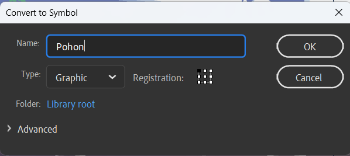

# Camera Movement & Layer Parenting

## 2.1 Adobe Animate Camera

Adobe Animate merupakan Adobe Flash dalam versi yang telah diperbaharui. Sesuai dengan namanya, Adobe Animate dapat digunakan untuk membuat animasi bergerak berbasis vektor. Adobe Animate mendukung embedding audio dan video, grafik raster, teks, dan ActionScript.

Pada Adobe Animate CC terdapat fitur bernama Camera Tool. Dengan fitur tersebut pengguna dapat membuat gerakan kamera sehingga tampilan terkesan lebih realistis pada animasi yang dibuat. Misalnya jika ada animasi berjalan, maka penggunaan camera tool dapat digunakan untuk membuat efek background parallax agar pergerakan karakter dan latar belakang terlihat lebih dinamis.

Gerakan kamera tool (Camera Movement) merupakan sebuah aktivitas membangun suasana dramatis dalam sebuah video maupun film dengan cara menggerakan kamera. Banyak alasan mengapa kamera harus bergerak, selain dapat membangun suasana dramatis, penggunaan gerakan kamera secara tepat dapat menciptakan visual yang lebih dinamis, mengarahkan perhatian penonton pada subyek tertentu, mengungkap maupun menyembunyikan dimensi ruang, dan juga dapat menciptakan visual yang lebih ekspresif.

Sedangkan Parallax biasanya digunakan dalam bidang 3 dimensi atau bidang nyata seperti depth perception (persepsi kedalaman) parallax biasanya dapat ditemui pada video game 2D tahun 90an yang digunakan sebagai ilusi agar gambar berjalan atau bergerak cepat, hal ini akan membuat latar belakang bergerak lebih lambat tetapi layer bagian depan bergerak lebih cepat.

## 2.2 Background Parallax

Parallax Background sendiri merupakan background yang menyambung pada kedua sisi nya sehingga saat di geser secara terus menerus tidak akan terlihat border atau batasan background tersebut, dan biasanya terdiri dari 2 atau lebih layer bergantung kebutuhan yang memiliki kecepatan berbeda untuk menciptakan ilusi jarak.

Efek paralaks adalah cara terbaik untuk memperkaya situs, memamerkan produk, dan menciptakan kesan mendalam. Berikut beberapa manfaat penggunaannya.

1. Kedalaman 3D: Dengan memisahkan lapisan dan memindahkannya dengan kecepatan berbeda, dapat mengelabui pikiran pengguna agar merasakan kedalaman 3D.
2. Skala pengertian: Memiliki lebih banyak elemen pada level berbeda memungkinkan dapat membedakannya satu sama lain dan memberikan kesan skala yang biasanya sulit disampaikan dengan gambar statis 2D.
3. Menargetkan fokus pengguna: Jika ingin tetap memperhatikan elemen tertentu, efek gulir memungkinkan menganimasi sesuatu atau segala sesuatu di sekitarnya untuk mempertahankan fokus.
4. Pisahkan konten: Situs B2B sering menggunakan efek paralaks untuk menampilkan penawaran penting perusahaan. Situs-situs ini memiliki banyak informasi, jadi ini adalah cara yang baik untuk membagi kontennya.
5. Desain modern: Desain yang ramping dan mengalir adalah bagian dari estetika web dan aplikasi seluler modern yang diikuti oleh perusahaan dari semua industri. Manfaatkan efek gulir semaksimal mungkin untuk menjaga desain tetap terkini.

Dengan menggunakan objek yang berbeda di lapisan latar depan dan latar belakang, Dapat mengontrol kecepatan dan posisi objek tersebut. Dengan menjaga kamera tetap fokus pada titik fokus konsta. Dapat juga menggerakkan objek dengan kecepatan berbeda untuk menciptakan efek tiga dimensi. Di Animate, saat membuat animasi 2D, dapat mencapai efek ini dengan menggunakan kamera dan fitur kedalaman lapisan. Seperti membuat efek paralaks untuk objek dengan mengubah kedalaman lapisan menggunakan panel Layer Depth.

## 2.3 Layer Parenting

Layer parenting merupakan fitur tebaru yang ada pada Adobe Animate, fitur ini dapat digunakan sebagai alternatif bone tool untuk membuat animasi pergerakan karakter seperti berjalan atau pegerakan badan lainnya, sesuai dengan istilahnya, layer parenting digunakan untuk membuat sebuah layer induk, dalam praktik penggunaannya, layer parenting sering digunakan untuk membuat gerakan karakter, bagian tumpuhan tubuh akan menjadi layer induk dan bagian bawahnya akan menjadi layer anak.

Cara yang baik untuk membayangkan hubungan ini adalah dengan memvisualisasikan lengan manusia. Jika Anda ingin menggerakkan tangan tanpa bagian lengan lainnya, maka dapat dengan mudah diputar di pergelangan tangan dan tidak mempengaruhi lengan bawah atau atas. Namun, menggerakkan lengan bawah atau atas juga akan mengubah posisi tangan karena tangan terikat pada kedua struktur tambahan tersebut. Pembuatan animasi menunjukkan bahwa layer parenting paling baik diterapkan hanya pada elemen tertentu selama tween span tertentu, dimana dislokasi sendi menjadi terlalu jelas. Dalam keadaan lain, akan lebih praktis untuk membiarkan elemen-elemennya independent dan menjaga fleksibilitas.

## 2.4 Membuat Efek Background Parallax dan Karakter Berjalan

### A. Camera Movement

#### 1. Buka Adobe Animate CC, pilih preset HD dan platform type menggunakan Action Script 3.0.

#### 2. Tampilan halaman Adobe Animate CC.

#### 3. Save As terlebih dahulu, isikan nama sesuai keinginan

#### 4. Klik File, pilih Import > Import to Stage untuk mengimport gambar bahan. Pilih file gambar bernama ‘Langit.png’ lalu klik open.

#### 5. Sesuaikan ukuran background langit dengan ukuran frame menggunakan Free Transform Tool (Q). Saat menyesuaikan ukuran gambar tahan tombol Shift agar ukuran panjang dan lebar tetap sama

#### 6. Ubah nama Layer_1 menjadi ‘Langit’, kemudian kunci layer.

#### 7. Buat layer baru dengan pilih New Layer dan ganti namanya menjadi ‘Jalan’

#### 8. Klik File, pilih Import > Import to Stage, lalu pilih file gambar bernama ‘Jalan.png’, lalu klik Open.

#### 9. Pastikan layer ‘Jalan’ frame 1 sudah diklik, sesuaikan ukuran gambar tersebut.

#### 10. Buat layer baru dan ubah namanya menjadi ‘Rumput’, kemudian geser dan letakkan dibawah layer ‘Jalan’.

#### 11. Import file gambar di layer ‘Rumput’, dengan klik File, pilih Import > Import to Stage dan pilih gambar dengan nama ‘Rumput.png’, lalu klik Open.

#### 12. Sesuaikan ukuran gambar, tekan Free Transform Tool (Q), kemudian sesuaikan sambil menekan Shift di keyboard agar panjang dan lebar tidak berubah.

#### 13. Buat new layer, ganti namanya menjadi ’Sawah’ dan letakkan layer tersebut dibawah layer ‘Rumput’.

#### 14. Klik File, pilih Import > Import to Stage dan pilih gambar dengan nama ‘Sawah.png’ lalu klik Open, Pastikan sebelumnya sudah klik di frame 1 layer ‘Batu Belakang’.

#### 15. Sesuaikan ukurannya seperti gambar dibawah ini.

#### 16. Buat new layer, ganti namanya menjadi ’Awan’ dan letakkan layer tersebut dibawah layer ‘Sawah’.

#### 17. Klik File, pilih Import > Import to Stage dan pilih gambar dengan nama ‘awan.png’ lalu klik Open. Pastikan sebelumnya sudah klik di frame 1 layer ‘Awan’.

#### 18. Sesuaikan ukurannya seperti gambar dibawah ini.

#### 19. Buat new layer, ganti nama menjadi ‘Pohon ” dan letakkan diatas layer ‘Jalan’.

#### 20. Klik File, pilih Import > Import to Stage dan pilih gambar dengan nama ‘Pohon.png’ lalu klik Open.

#### 21. Sesuaikan ukuran pohon tersebut dan posisikan seperti gambar dibawah ini.

#### 22. Klik kanan ‘Pohon’ tersebut lalu pilih Convert to Symbol.

#### 23. Ganti namanya menjadi “Pohon” dan ganti Typenya menjadi Graphic, lalu klik OK.

#### 24. Klik gambar pohon, pergi ke Properties, cari Color Effect dan ubah di bagian Style menjadi Brigtness, ubah nilai Bright ke -20%, agar tercipta gelap pada pohon.

#### 25. Kemudian Kunci Layer Langit, Awan, Sawah, Rumput dan Jalan, kecuali Layer Pohon

#### 26. Klik Camera maka Layer Camera akan muncul di atas sendiri.

#### 27. Klik menu Windows di menu bar, pilih Layer Depth.

#### 28. Isikan nilai Layer Depth seperti gambar dibawah ini atau bisa disesuaikan. Layer Depth ini jika nilai semakin kecil maka objek akan lebih dekat ke kamera. Pada saat mengatur nilai depth, objek akan terlihat mengecil atau membesar maka dari itu butuh penyesuaian ukuran, gunakan Free Ttransform Tool(Q) untuk menyesuaikan ukuran objek dengan halaman kerja (garis berwarna biru adalah indikasi layar kamera).

#### 29. Klik Attach pada layer ‘Langit’ seperti gambar dibawah ini, agar layer ‘Langit’ tetap berada di tempat saat Camera digunakan.

#### 30. Block frame pada semua layer di di detik 9 atau di frame 215, klik kanan pilih Insert Keyframe.

#### 31. Pada Frame ke 215 gunakan Camera Tool kemudian arahkan cursor ke tengah halaman, tahan dan geser kursor ke kanan sambil menekan tahan Shift, maka objek-objek tersebut akan bergerak ke kiri mengikuti arahan kamera.

#### 32. Klik frame mana saja diantara frame 1- 215 di layer ‘Camera’, klik kanan kemudian pilih Create Classic Tween.

#### 33. Tekan Ctrl+Enter untuk menjalankan Animasi, maka akan tercipta efek background parallax menggunakan camera movement.

### B. Layer Parenting

#### 1. Klik File, pilih Import > Import to Stage dan pilih file dengan nama ‘Character.ai’ lalu klik Open.

#### 2. Maka akan muncul jendela Import, lalu klik Import.

#### 3. Buka Layer Depth, dengan klik menu Windows > Layer Depth, ubah nilai Depth layer ‘Karakter’ dan sesuaikan ukuran karakter jika dirasa terlalu besar.

#### 4. Klik frame 1 layer ‘Karakter’ kemudian klik kanan gambar karakter tersebut, pilih Convert to Symbol.

#### 5. Ubah namanya menjadi Karakter dan ubah Type menjadi Graphic, kemudian klik OK.

#### 6. Double klik karakter tersebut, disini kita akan menganimasikan pergerakan karakter tersebut dan memisah perbagian badan karakter menjadi layer terpisah, jadi 1 layer untuk 1 bagian badan.

#### 7. Klik kepala, klik kanan pilih cut atau bisa dengan shortcut Ctrl+X.

#### 8. Buat new layer dan beri nama ’Kepala’ untuk menampung objek gambar kepala. Klik kanan pilih Paste in Place atau dengan shortcut Ctrl+Shift+V.

#### 9. Lakukan Cut di bagian leher.

#### 10. Buat new layer, beri nama ‘Leher’ dan Paste in Place (Ctrl+Shift+V) untuk menampung objek gambar dari leher.

#### 11. Lakukan hal yang sama berulang kali hingga semua bagian potongan tubuh berada dalam layer yang berbeda, urutkan layer tersebut seperti gambar dibawah ini.

#### 12. Klik kanan objek kepala, pilih Convert to Symbol, isikan nama dan ubah Type menjadi Graphic, klik OK. Lakukan hal yang sama ke bagian tubuh lainnya.

#### 13. Klik Show All Layers as Outline, agar karakter terlihat garis tepi saja, ini bertujan untuk memudahkan menggeser titik perputaran ke tempat yang seharusnya.

#### 14. Klik objek kepala, tekan Free Transform Tool(Q) di keyboard untuk menggeser titik putar. Berikut adalah titik putar bagian kepala.

#### 15. Titik putar Leher dan Badan.

#### 16. Titik putar LenganKiri_Atas, LenganKanan_Atas, LenganKiri_Bawah, dan LenganKanan_Bawah.

#### 17. Titik pusat KakiKiri_Atas, KakiKanan_Atas, KakiKiri_Bawah, KakiKanan_Bawah.

#### 18. Titik pusat Telapak_Kanan dan Telapak_Kiri.

#### 19. Klik Show Parenting View.

#### 20. Sambungkan antara layer satu dengan yang lain dengan men-drag kotak warna frame untuk menghubungkan layer anggota badan yang terpisah seperti pada gambar di bawah ini.

#### 21. Ubah pose pada frame 1 (boleh sesuai kreatifitas masing-masing), di seluruh layer frame 1, gunakan free transform tool(Q).

#### 22. Blok di Frame 30 semua layer, klik kanan Insert Keyframe.

#### 23. Blok di Frame 5 semua layer, kemudian Insert Keyframe. Kemudian ubah gerakan karakter seperti gambar dibawah ini.

#### 24. Lakukan hal yang sama pada frame 10, 15, 20,25.

#### 25. Blok semua frame di semua layer tersebut. Kemudian klik kanan, dan pilih Create Classic Tween.

#### 26. Kembali ke Scene 1, kemudian klik kanan Frame 215 pada layer ‘Charakter’ kemudian pilih Insert Keyframe.

#### 27. Ubah posisi karakter dengan menggesernya ke kanan (usahakan didalam lingkup kamera).

#### 28. Klik kanan antara Frame 1 sampai 215 di layer ‘Charakter’, kemudian pilih Create Classic Tween.

#### 29. Tekan Ctrl+Enter untuk melihat hasil animasi.

