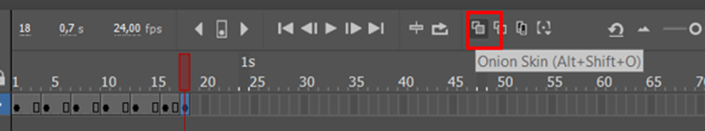

# Frame By Frame & Lip Sycronation

## III.1 Animasi Frame by Frame

### A. Frame by Frame

Frame by frame adalah teknik pembuatan animasi dengan menggunakan rangkaian gambar diam yang berurutan (sequence) frame demi framenya, sehingga menciptakan ilusi berupa pergerakan karakter. Pada setiap framenya berisi gambar diam yang dimainkan secara berurutan dan bergerak melintasi stage, bentuk atau pose gambar akan berubah di dalam keyframe yang ditandai dengan titik hitam dalam frame.

Animasi frame-by-frame melibatkan penggambaran setiap frame secara manual, berikut ciri-ciri animasi frame-by-frame :

1. Melibatkan penggambaran setiap frame secara manual.
2. Dapat menghasilkan animasi yang sangat halus dan detail.
3. Membutuhkan waktu dan usaha yang lebih banyak karena setiap frame harus digambar secara manual.
4. Dapat digunakan untuk animasi perubahan bentuk secara dinamis seperti efek gerakan air, api, ledakan, dan sebagainya
   Dengan demikian, animasi frame-by-frame memungkinkan untuk detail yang lebih tinggi.

### B. Kelebihan dan Kekurangan Animasi Frame by Frame

Kelebihan animasi frame-by-frame adalah dapat menghasilkan animasi yang sangat halus dan detail karena setiap perubahan gerakan atau bentuk objek diletakkan pada frame secara berurutan. Selain itu, metode ini memungkinkan animator untuk memiliki kontrol penuh atas setiap frame animasi.
Sedangkan kekurangan animasi frame-by-frame adalah membutuhkan waktu dan usaha yang lebih banyak untuk membuat animasi karena setiap frame harus digambar secara manual. Selain itu, animasi frame-by-frame juga dapat menghasilkan file yang besar ukuranya.

## III.2 Lip Sycronation

Dalam istilah paling sederhana, sinkronisasi bibir bisa disebut sebagai proses dan cara untuk mensinkronisasikan suara ke karakter di animasi. Sinkronisasi bibir membawa karakter menjadi lebih hidup serta membuat merekan terlihat seperti berbicara. Proses sinkronisasi bibir dalam animasi termasuk dialog dan juga grafik mulut. Dialog dipecah menjadi suku kata fonetik serta bingkai yang berisi suku kata ini dapat diakses. Animasi ialah gambar bergerak dan berbicara dan kehidupan ini datang dari dialog bahwa mereka berbicara. Maka, untuk membuat ini terlihat seperti asli berbicara, sinkronisasi bibir yang sempurna sangat penting, pada Adobe Animate 2019 terdapat terdapat fitur auto lip sync, fitur tersebut otomatis menyeseuaikan dengan audio untuk mendapat gerakan mulut, jadi tidak perlu memyesuaikannya secara manual dan hanya perlu menyiapkan bentuk mulut untuk otomatis lip sync.

Untuk membuat lip sync perlu tahu posisi-posisi mulut saat mengeluarkan suara tertentu, bentuk mulut memperlihatkan huruf yang diucapkan, contoh seperti dalam kolom fitur auto lip sync diatas terdapat bentuk mulut karakter yang berbeda sesuai dengan pelafalan "Ah, D, Ee, F, L, M, dst"

## III.3 Langkah-Langkah Animasi Frame by Frame

### 1. Buka Adobe Animate CC 2019, pilih Open untuk membuka project BAB 3 yang sudah dibuat sebelumnya.

### 2. Tampilan halaman Project BAB 2 di Adobe Animate CC.

### 3. Save As terlebih dahulu, isikan nama sesuai keinginan.

### 4. Sebelum masuk ke praktik pembuatan frame by frame, kita akan membuat bagian bayangan dari karakter terlebih dahulu. Pada bagian layer Character klik kanan dan pilih Duplicate Layers.

### 5. Posisikan layer Duplicate dibawah layer Character. Ubah namanya menjadi ‘Bayangan’ dan kunci layer “Character”.

### 6. Klik Frame 1 Layer Bayangan , ubah bentuk objek Bayangan Karakter seperti dibwah ini menggunakan Free Transform Tool(Q).

### 7. Klik Frame 1 layer ‘Bayangan’, pergi ke Properties > Filter kemudian Add Filter dan pilih Drop Shadow.

### 8. Pada Filter Drop Shadow, ubah Strength menjadi 50% dan centang Hide Object seperti gambar dibawah ini

### 9. Hasilnya akan terlihat seperti ini.

### 10. Klik kanan Frame 1 layer ‘Bayangan’ pilih Copy Frame.

### 11. Klik Frame 215 layer ‘Bayangan_Karakter’, klik kanan pilih Paste and Overwrite Frames.

### 12. Tetap berada di Frame 215, sekarang geser objek bayangan dari kiri ke kanan hingga sejajar dengan objek karakter.

### 13. Sekarang kita masuk ke pembuatan Frame by frame. Buat Later Baru diatas layer Jalan bernama Burung.

### 14. Pada Frame 1 layer Burung, Klik File, pilih Import > Import to Stage untuk mengimport gambar bahan.

### 15. Pilih file gambar bernama ‘Red_Bird1.png’, lalu klik open.

### 16. Karena gambar terdeteksi sebagai sequence yang berurutan, maka klik saja No pada kotak dialog seperti dibawah ini.

### 17. Pada Tools Bar pilih Window

### 18. Atur nilai posisi objek ‘Burung’ menjadi -30.

### 19. Sementara biarkan ukurannya besar.

### 20. Kemudian klik kanan gambar tersebut, pilih Convert to Symbol.

### 21. Isikan nama ‘Burung’ dan ubah Type-nya menjadi Graphic, kemudia klik OK.

### 22. Double klik gambar Burung tersebut, disini kita akan membuat sebuah animasi frame by frame Burung.

### 23. Pastikan Frame 2 sudah diklik, kemudian insert keyframe, kemudian lakukan Import dan pilih file gambar dengan nama ‘.png’, lalu pilih Open.

### 24. File gambar akan terdeteksi sebagai gambar berurutan, jika kotak dialog seperti ini muncul, pilih Yes.

### 25. Maka setiap gambar akan terpisah dalam setiap frame.

### 26. Kemudian cek pada frame 1, terdapat objek burung yang tertimpa.

### 27. Hapus salah 1 object burung pada frame 1.

### 28. Blok keyframe ke-2 sampai 6, kemudian drag ke kanan dengan jarak 2 frame.

### 29. Lakukan hal yang sama pada keyframe ke-3 dan seterusnya dengan jarak 2 frame.

### 30. Aktifkan Onion Skin (Alt+Shift+O) agar gambar di keyframe sebelumnya terlihat dan mempermudah untuk dianimasikan.

### 31. Kembali ke scene 1, kecilkan ukuran object Red Bird.

### 32. Kemudian pada frame 215, insert Keyframe.

### 33. Geser object Burung seperti dibawah ini pada frame 215.

### 34. Kemudian diantara frae 1-215, klik kanan salah satu frame, kemudian create classic Tween.

### 35. Tekan Ctrl + Enter untuk melihat hasil animasi.

## III.4 Langkah-langkah Lip Sycronation

### 1. Pada Layer Character, Double Klik pada Character unutk masuk ke Scene Character.

### 2. Double klik terus pada bagian mulut, untuk masuk ke Sceen seperti di bawah ini dan gunakan Free Transform Tools(Q) untuk menghapus bagian mulut.

### 3. Kembali ke Scene Character.

### 4. Buat layer baru bernama Mulut

### 5. Pada frame 1 layer mulut, pilih File > Import > Import to Stage.

### 6. Cari folder file Mulut, buka dan pilih gambar bernama ‘1.png’, jika sudah pilih Open.

### 7. Karena gambar terdeteksi sebagai sequence yang berurutan, maka klik saja No pada kotak dialog seperti dibawah ini.

### 8. Sementara biarkan ukurannya besar. Kemudian klik kanan gambar tersebut, pilih Convert to Symbol.

### 9. Klik frame 2 layer ‘Layer_1’ dan klik kanan > Insert Blank Keyframe.

### 10. Kemudian pilih File Cari folder file Mulut, buka dan pilih gambar bernama ‘2.png’, jika sudah pilih Open.

### 11. Gambar akan terdeteksi sebagai sequence berurutan, pilih Yes, maka gambar mulut akan berada pada keyframe tersendiri.

### 12. Kembali ke Scene Character, kemudian perkecil ukuran mulut dan posisikan gambar mulut pada wajah.

### 13. Double klik pada mulut, unutk kembali lagi ke sceen mulut, Aktifkan Onion Skin, kemudian rapikan posisi dan ukuran mulut.

### 14. Kembali ke scene ‘Character’. Pada frame 30 layer mulut insert Keyframe.

### 15. Buat Layer baru diatas layer mulut, beri nama Audio.

### 16. Lakukan Import dan cari file audio bernama ‘Voice.mp3’.

### 17. Klik pada gambar mulut, kemudian pada properties pilih Lip Syncing. Maka akan muncul jendela Lip Sync, klik bagian ‘Ah’ maka yang sebelumnya sudah memasukkan gambar mulut akan otomatis muncul.

### 18. Masukkan satu persatu gambar tersebut sesuai urutan, kemudian pada Sync with Audio pilih layer ‘Audio’ yang sudah diimport file audio sebelumnya. Klik Done, maka adobe animate akan otomatis mensiknkronkan Gerakan mulut sesuai dengan audio.

### 19. Setelah dilakukan Lip sycronation hasilnya akan seperti ini.

### 20. Kembali ke Scene 1, dan buat layer baru bernama Audio.

### 21. Lakukan Import dan cari file bernama ‘voice.mp3’, jika sudah pilih Open.

### 22. Akan muncul window seperti ini, pilih replace existing items. Kemudian OK

### 23. Tekan Ctrl + Enter untuk melihat hasil animasi.

